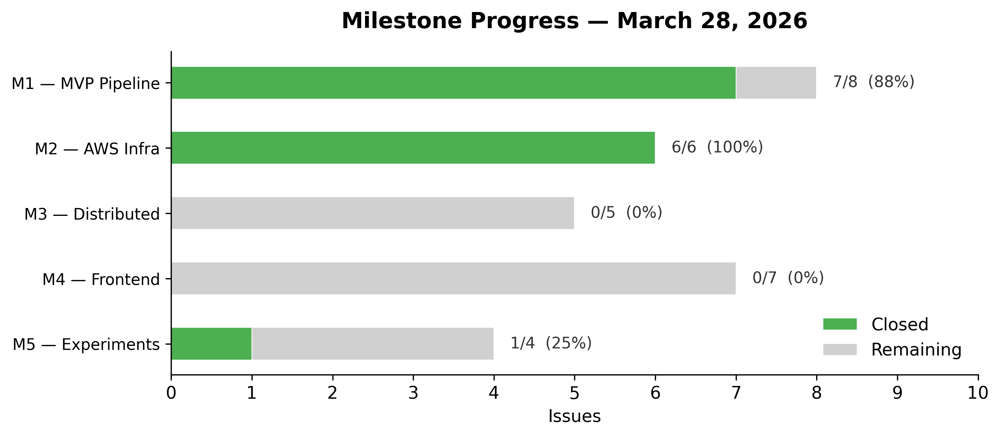
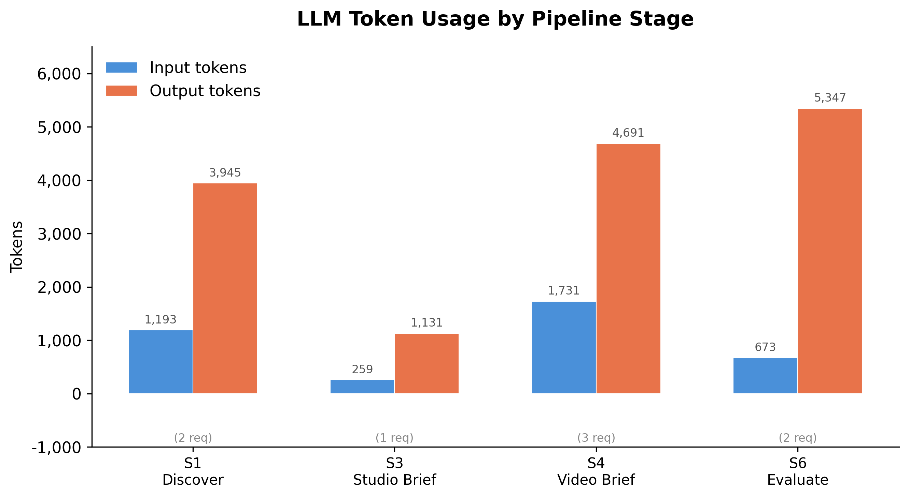
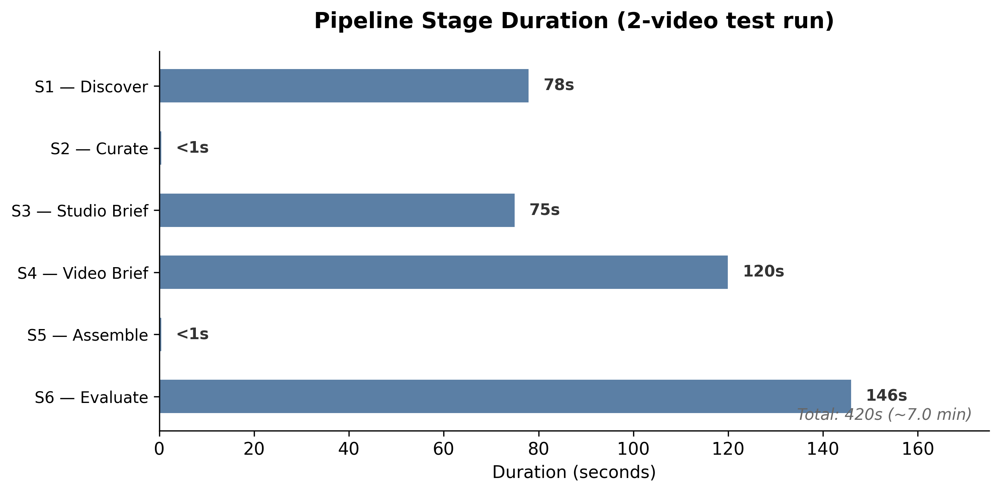

# CS6650 Distributed Systems — Milestone 1 Report

**Project:** Flair2 — AI Campaign Studio
**Team:** Sam Wu, Jess
**Repository:** [github.com/yangyang-how/flair2](https://github.com/yangyang-how/flair2)
**Date:** March 28, 2026

---

## 1. Problem, Team, and Overview of Experiments

### Problem

Short-form video creators face a brutal discovery problem. To stay relevant, they manually watch hundreds of viral videos trying to intuit what makes content work — then write scripts by hand based on subjective pattern-matching. This process is slow, inconsistent, and produces derivative copies rather than authentic content adapted to a creator's own voice.

Flair2 automates this entire workflow with a six-stage AI pipeline that extracts structural patterns from viral videos, generates candidate scripts, evaluates them through crowd-simulation voting, and personalizes the top performers to match a specific creator's voice and style. The system treats content strategy as a data problem, not a guessing game.

### Team

| Member | Responsibilities | Background |
|--------|-----------------|------------|
| **Sam Wu** | Pipeline architecture, all 6 stage implementations, provider abstraction layer, CLI runner, frontend (upcoming) | Software engineering, AI/ML pipeline design |
| **Jess** | AWS infrastructure, Terraform (VPC, ECS, ALB, S3, DynamoDB, ElastiCache, Lambda, IAM), CI/CD, deployment | Cloud infrastructure, DevOps |

### Planned Experiments (Milestone 5)

We have designed three experiments that target genuine distributed systems challenges — not synthetic benchmarks, but problems that emerge naturally from running AI workloads at scale with shared resources:

1. **Multi-tenant backpressure** — How does the system behave when 5+ concurrent users share a single LLM API rate limit? We will measure throughput degradation, queue depth growth, and fairness across tenants as concurrency increases from 1 to 10 simultaneous pipeline runs.

2. **Failure recovery and run isolation** — When one user's pipeline fails mid-run (e.g., during stage S4 voting), do other users' pipelines continue unaffected? We will verify run isolation, checkpoint-based resumption, and that partial failures do not corrupt shared state.

3. **Cross-user cache concurrency** — When two users analyze overlapping video sets, does our `SETNX`-based caching strategy reduce redundant LLM calls without introducing race conditions or stale reads? We will measure cache hit rates and verify correctness under concurrent access.

### Role of AI in the System

Gemini and Kimi LLMs power four of the six pipeline stages: S1 (video analysis), S3 (script generation), S4 (crowd-simulation voting), and S6 (voice personalization). Stages S2 and S5 are pure algorithmic — pattern aggregation and score ranking, respectively — requiring no LLM calls.

### Observability

Observability is built into the pipeline from day one, not retrofitted:

- **Structured logging** via `structlog` with correlation IDs (`run_id`) across all components
- **UsageTracker** records per-stage metrics: token counts, request counts, latency
- **CloudWatch** aggregates ECS container metrics and Redis performance data on AWS
- **GitHub Actions CI** runs the full test suite on every push

---

## 2. Project Plan and Recent Progress

### Timeline

| Milestone | Owner | Dates | Status |
|-----------|-------|-------|--------|
| M1 — MVP Pipeline | Sam | Mar 25–28 | 88% complete (7/8, 1 suspended) |
| M2 — AWS Infrastructure | Jess | Mar 28–Apr 4 | 100% complete (ahead of schedule) |
| M3 — Distributed System | Both | Apr 4–8 | Planned |
| M4 — Frontend | Sam | Apr 8–11 | Planned |
| M5 — Experiments | Both | Apr 11–15 | Planned |



### Current State

**29 total issues** tracked on GitHub, **14 merged PRs** across two parallel development tracks.

**M1 (Pipeline — Sam):** All six stages are implemented and tested. The pipeline has completed a real end-to-end run producing personalized scripts from raw video transcripts. The test suite covers 45 tests across unit and integration levels. A provider abstraction layer (`ReasoningProvider` protocol) allows swapping LLM backends with zero changes to stage code. Currently running on Kimi K2.5 via the Kimi Code API.

**M2 (Infrastructure — Jess):** Completed ahead of schedule. Full Terraform configuration deployed: VPC with public/private subnets, ECS Fargate cluster, Application Load Balancer, S3 for output storage, DynamoDB for run metadata, ElastiCache (Redis) for caching and task queuing, Lambda for async triggers, IAM roles with least-privilege policies, and Secrets Manager for API keys. CI/CD pipeline is operational via GitHub Actions.

### AI in Development

We use Claude Code (operating as "Shannon") for architecture design, code generation, automated PR review, and research synthesis. The tool has accelerated development roughly 3x, particularly in synthesizing 8,000+ lines of research documents into actionable pipeline prompts. The tradeoff: generated code requires careful human review to catch subtle issues — LLMs are confident even when wrong. Benefits include consistent code style across the codebase and comprehensive test coverage that we might have cut corners on under time pressure.

---

## 3. Objectives

### Short-Term (by April 15)

- Working multi-user distributed pipeline deployed on AWS ECS
- Three experimental results with quantitative analysis and charts
- Frontend with real-time pipeline visualization (SSE-based progress streaming)
- Approximately 20 posted videos with performance data feeding back into the pipeline

### Long-Term (beyond course)

- **Multi-provider LLM routing** — currently supports Kimi and Gemini; the provider abstraction makes adding Claude, GPT, or open-source models trivial
- **Platform API integration** — automated collection of engagement metrics (views, likes, shares) from TikTok/YouTube to close the feedback loop
- **A/B testing framework** — compare prompt strategies and pipeline configurations with statistical rigor
- **Open-source release** — package as a standalone creator tool

### Observability Plan

Every LLM call is tracked by the `UsageTracker` with stage identity, token counts (input/output), and wall-clock latency. CloudWatch aggregates container-level metrics (CPU, memory, network) and Redis operations (cache hits, queue depth). DynamoDB stores run metadata for historical trend analysis. All log entries carry a `run_id` correlation ID, making it possible to trace a single pipeline execution across all six stages and every infrastructure component.

---

## 4. Related Work

### Course Readings

- **Designing Data-Intensive Applications** (Kleppmann) — The pipeline's stage-by-stage architecture follows Kleppmann's principle of *explicit data flow*: each stage reads from a well-defined input and writes to a well-defined output, with no hidden side channels. The state machine orchestration pattern guides our run lifecycle management. DynamoDB partitioning strategies inform how we shard run metadata by `user_id`.

- **MapReduce** (Dean & Ghemawat, 2004) — The S1→S2 and S4→S5 stage pairs are direct implementations of the MapReduce paradigm. S1 maps individual videos to pattern analyses; S2 reduces them into an aggregated pattern library. S4 maps persona votes across candidate scripts; S5 reduces votes into ranked scores. This is MapReduce applied to AI evaluation rather than text processing — same computational model, fundamentally different workload characteristics.

### External References

- **Gopher-Lab TikTok datasets** (MIT License) — 8,000 video transcripts used as pipeline input for the analysis stage
- **YouTube/TikTok Trends 2025** (CC BY 4.0) — 48,000 engagement signals providing ground-truth data on what content actually performs
- **Viral content psychology research** — 8,300+ lines of synthesized research documents in the repository, distilled into pipeline prompts

### Related Class Projects

**1. Compute-Limited GenAI Platform Backend — Srijan Pokharel & Pranjal Kanel**

This project is the closest conceptual match to ours. Both systems are built around a central question: how do you handle LLM workloads under compute and API constraints? Their architecture decouples request intake from processing via a queue and models compute scarcity by capping worker concurrency — then runs controlled experiments to observe saturation, tail latency, and overload behavior.

The overlap is most direct in their Experiment 3 (bounded queue + API rate limiting vs. unbounded queue vs. rejection), which maps almost exactly to our Experiment 1, where we measure a Redis token bucket rate limiter under multi-tenant LLM API contention. Both experiments ask the same underlying question: what is the right overload strategy, and what does the system actually lose under each policy?

The key architectural difference is in how the LLM is represented. Their system simulates the LLM pipeline with controlled preprocessing and inference delays, which gives clean experimental control over latency distributions. Our system calls real external APIs (Kimi K2.5 / Gemini), which introduces real-world variance — provider cold starts, unpredictable response times, and quota enforcement behavior that cannot be replicated in simulation. Each approach has its tradeoff: their setup isolates variables more cleanly; ours captures the messiness of production API dependencies.

**2. StreamScale: Distributed Music Streaming Backend — Yatish, Mayank, Parthav**

StreamScale and our project share a substantial technical substrate. Both systems are built on microservices deployed on AWS ECS Fargate behind an ALB, both use Redis and DynamoDB as their primary data layer, and both use Locust for load testing and measure the effect of horizontal ECS scaling on throughput and latency.

The divergence is in what problem each system is solving. StreamScale's core challenge is write consistency under concurrent play events — ensuring that thousands of simultaneous writes do not silently drop updates, and demonstrating that an SQS-buffered event-driven architecture recovers accuracy that a naive direct-write approach loses under load. Our focus is multi-tenant backpressure — specifically, how multiple concurrent users sharing a single LLM API key interact under load, and how Redis SETNX atomicity ensures exactly one LLM call is issued per unique input across concurrent workers. Where StreamScale asks "do all writes land?", we ask "who gets to write, and when?". Both are concurrency problems, but at different layers of the stack.

**3. Real-Time Distributed Monitoring + AI DevOps Agent — Dylan Pan, Zongwang Wang, Lucas Chen, Ellis Guo**

This project shares two architectural patterns with ours that do not appear together in most other class projects. The first is a closed feedback loop where system outputs influence future behavior. Their AI DevOps Agent reads aggregated CPU trend data from Kafka and uses an LLM to generate and apply Terraform changes, which then flow back into the system as new producer metrics. Our pipeline has an analogous loop: historical video performance data is read from DynamoDB and injected into the next pipeline run's LLM prompts, so past outcomes shape future content generation decisions. In both cases, the LLM is not a terminal endpoint but a step inside a cycle.

The second shared pattern is treating fault isolation as a first-class design concern. Their Experiment 7 (crashing the AI agent mid-cycle should not affect the rest of the Kafka pipeline) directly mirrors our Experiment 2, where a worker crash for one user's pipeline run should have no impact on other concurrent users' runs. Both experiments validate the same property: that an AI component's failure is contained and does not propagate to the broader system.

The primary difference lies in what the LLM is doing. Their agent makes infrastructure decisions that directly mutate the live AWS environment via Terraform apply — high-stakes, low-frequency. Our LLM generates content across approximately 260 API calls per pipeline run under a shared rate limiter — high-frequency, lower-stakes per call, but sensitive to cumulative quota pressure.

---

## 5. Methodology

### Pipeline Architecture

The pipeline processes content through six stages organized as two MapReduce cycles with sequential stages between them:

```
MapReduce Cycle 1:
  S1 (Map)  → Analyze 100 videos → extract structural patterns per video
  S2 (Reduce) → Aggregate patterns into a unified pattern library

Sequential:
  S3 (Generate) → Produce 50 candidate scripts from the pattern library

MapReduce Cycle 2:
  S4 (Map)  → 100 simulated personas vote on each candidate script
  S5 (Reduce) → Rank candidates by weighted score, select top performers

Sequential:
  S6 (Personalize) → Adapt top 10 scripts to creator voice + generate video prompts
```

### Provider Abstraction

The `ReasoningProvider` protocol defines a uniform interface for LLM backends. Any provider that implements the protocol can be swapped in with zero changes to stage code. Currently implemented: Kimi K2.5 (reasoning-optimized, used for all LLM stages) and Gemini (planned for video generation). This design follows the **strategy pattern** — each provider encapsulates its own API specifics behind a common interface.

### Distributed Architecture (Milestone 3)

- **Celery** task queue backed by Redis for asynchronous stage execution
- **ECS Fargate** workers scale horizontally without managing EC2 instances
- **Application Load Balancer** distributes HTTP and SSE connections across API instances
- **DynamoDB** stores run metadata (status, stage progress, timestamps)
- **S3** persists pipeline outputs (pattern libraries, scripts, video prompts)
- **ElastiCache (Redis)** provides both the Celery broker and the `SETNX`-based analysis cache

### Experiment Design

**Experiment 1 — Multi-tenant backpressure:**
Launch 1, 3, 5, and 10 concurrent pipeline runs against a shared Kimi API rate limit. Measure per-run throughput, total system throughput, queue depth over time, and fairness (variance in completion times across runs). The hypothesis: throughput scales linearly until hitting the API rate ceiling, then degrades gracefully with backpressure rather than failing.

**Experiment 2 — Failure recovery and run isolation:**
Start three concurrent pipeline runs. Kill a Celery worker mid-S4 (the most request-intensive stage) for one run. Verify: (a) the other two runs complete successfully, (b) the failed run's state is correctly checkpointed, (c) restarting the worker resumes the failed run from its checkpoint rather than restarting from scratch.

**Experiment 3 — Cross-user cache concurrency:**
Two users submit overlapping video sets (50% overlap). Measure cache hit rate on the overlapping videos, verify no stale reads via content hashing, and compare total LLM calls against the no-cache baseline. The `SETNX` approach ensures exactly one LLM call per unique video even under concurrent access.

### Key Tradeoffs Under Evaluation

- **Sequential vs. parallel S3 generation** — Parallel is faster but may produce less diverse scripts if the LLM sees similar context windows simultaneously. We will measure diversity scores.
- **Worker count vs. rate limit ceiling** — Adding workers beyond what the API rate limit can sustain wastes compute. We need to find the saturation point.
- **Cache granularity** — Per-video caching (current) is simple but coarse. Per-pattern caching would yield more hits but increases Redis operations. We will measure the cost/benefit crossover.

---

## 6. Preliminary Results

### First Real Pipeline Run (March 28, 2026)

- **Provider:** Kimi K2.5 via Kimi Code API
- **Input:** 2 videos from Gopher-Lab/Trends dataset
- **Parameters:** 3 candidate scripts, 3 simulated personas, top 2 selected
- **Total:** 8 API calls, 3,856 input tokens, 15,114 output tokens
- **Duration:** ~7 minutes
- **Output:** 2 fully personalized scripts with detailed video prompts



| Stage | Requests | Input Tokens | Output Tokens |
|-------|----------|-------------|---------------|
| S1 — Analyze | 2 | 1,193 | 3,945 |
| S3 — Generate | 1 | 259 | 1,131 |
| S4 — Vote | 3 | 1,731 | 4,691 |
| S6 — Personalize | 2 | 673 | 5,347 |
| **Total** | **8** | **3,856** | **15,114** |



### Sample Pipeline Output

Below are the two scripts produced by the test run — real output, not mocked. Each includes the original generated script, a version personalized to the creator's voice, and a detailed video production prompt.

**Script #1 (Rank 1, Vote Score: 15.0) — Pattern: story + steady pacing**

> *Original hook:* "I deleted every single photo off my phone last Tuesday."
>
> *Original body:* Not from the cloud. Not the backup. Just... gone. Fourteen thousand memories, and my hands were shaking as I watched the bar empty. But then I stopped. [beat] I realized I couldn't remember taking half of them. I was so busy proving I was happy, I forgot to actually feel it.
>
> *Original payoff:* "The best moments of your life will never need an audience. Put the phone down."

After S6 personalization (injecting the creator's casual/energetic tone, vocabulary like "no cap," "insane," "lowkey," and catchphrases like "let's gooo"):

> Okay no cap, I did something absolutely insane last Tuesday. Deleted every single photo off my phone. Not the cloud, not the backup — just... poof. Fourteen thousand pics and my hands were literally shaking. But wait for it... [beat] I couldn't even remember taking half of them. I was so busy chasing this fire aesthetic that I lowkey forgot to actually feel the moment. Trust me on this — the best vibes of your life don't need an audience. Put the phone down and let's gooo actually live.

The system also generated a detailed video prompt specifying shot composition, color grading, text overlay animations, audio cues, and pacing (frantic 16fps stutter cuts for the opening, one frozen frame for the beat, smooth 60fps for the walk-away ending). Total runtime: 24 seconds.

**Script #2 (Rank 2, Vote Score: 11.0) — Pattern: direct_address + staccato pacing**

> *Original hook:* "Your phone is making you ugly."
>
> *Original body:* Tech neck. Eye bags. Blue light aging. You check it 96 times daily. Squinting. Frowning. Lines forming. Deep ones. Permanent. [HARD CUT TO BLACK/SILENCE] Stop.
>
> *Original payoff:* "Hold it at eye level. Today."

After S6 personalization:

> Your phone is lowkey aging you. No cap. Tech neck. Eye bags. Blue light? Insane. 96 times daily. Squinting. Frowning. Lines forming. Deep ones. Permanent. [HARD CUT TO BLACK/SILENCE] Stop. Hold it eye level. Today. Trust me on this. Let's gooo.

This script used a completely different structural pattern (staccato rhythm with fragmented delivery) yet the personalization consistently injected the creator's voice without breaking the structure.

**What this demonstrates:** The pipeline doesn't just generate generic content — it extracts *structural mechanics* (hook types, pacing patterns, emotional arcs) from real viral videos, generates scripts that follow those structures, runs simulated audience voting to surface the best candidates, then rewrites them in the creator's authentic voice. The two scripts above use fundamentally different structural patterns but both sound like the same creator.

### Key Observations

**S4 (voting) dominates request count.** Each persona casts a separate vote, so request count scales linearly with persona count. In production configuration (100 personas × 50 scripts), S4 alone accounts for the majority of all API calls. This makes S4 the primary target for caching and batching optimizations.

**S6 (personalization) produces the most output tokens per request.** Each personalization generates both a full script and a detailed video production prompt — substantial structured output. This stage will benefit most from output caching when creators re-run with the same top scripts.

**S1 (analysis) is input-heavy.** Full video transcripts are included in the prompt, making input token count proportional to transcript length. Compression or summarization of transcripts before S1 is a potential optimization.

### Projected Full-Scale Workload

A production run with 100 videos, 50 scripts, 100 personas, and 10 personalized outputs requires an estimated **261 LLM calls** and **~500K tokens**. At Kimi's Tier 0 rate limit (3 RPM), this takes ~87 minutes. At Tier 1 (200 RPM), ~1.3 minutes. **The rate limit tier is the dominant performance factor**, not compute or network — a genuine distributed systems constraint that our backpressure experiment (Experiment 1) directly addresses.

### Remaining Work

- Full-scale run with 100 videos (currently throttled by Tier 0 rate limits)
- M3 distributed deployment and the three planned experiments
- Frontend visualization of real-time pipeline progress via SSE
- Performance feedback loop: post generated content, collect engagement data, feed back into pipeline

---

## 7. Impact

### Why This Project Matters for Distributed Systems

This is not a toy MapReduce implementation counting words in text files. The pipeline runs real MapReduce cycles over real AI workloads where each "map" operation costs money, takes variable time, and can fail unpredictably. The distributed systems challenges are genuine:

- **Multi-tenant resource contention** with a shared external API rate limit — a constraint that cannot be solved by adding more hardware
- **Failure recovery** in a pipeline where each stage's output depends on the previous stage's complete results
- **Cache correctness** under concurrent access where cache misses cost real dollars in LLM API calls

### Cross-Class Testing Opportunity

Other students could submit their own creator profiles and receive personalized scripts, testing the multi-user pipeline under real concurrent load. This directly feeds Experiment 1 (backpressure) with organic traffic patterns rather than synthetic benchmarks — and produces actually useful output for participants.

### Portfolio Value

The project demonstrates a complete vertical slice of modern AI infrastructure: agentic pipeline architecture, distributed task execution on AWS, multi-provider LLM integration, real-time frontend visualization, and observability from the ground up. This is the exact skill set that AI infrastructure and platform engineering roles demand — not because we designed it for a resume, but because the problem genuinely requires it.
